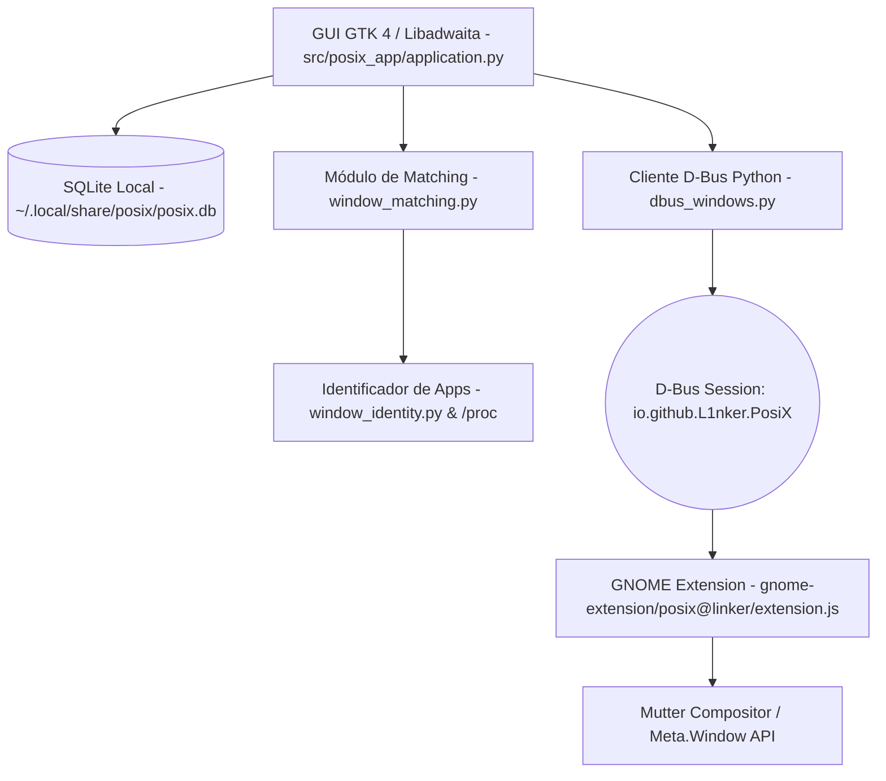

# 🖥️ PosiX — Master Plan & Arquitetura Definitiva

**Projeto:** PosiX (Gerenciador e Restaurador de Posições e Geometria de Janelas para Linux/GNOME)  
**Nome de Apresentação:** PosiX by Linker  
**Versão:** 1.0 (Consolidado e Migrado para Antigravity)  
**Data:** 17 de Agosto de 2026  
**Responsável:** Desenvolvedor Líder  

---

## 1. 🧭 Visão do Produto & Proposta de Valor

O **PosiX** é uma aplicação nativa para Linux (especialmente Zorin OS / GNOME) destinada a salvar, organizar e restaurar posições e dimensões exatas de janelas em configurações de um ou múltiplos monitores.

* **Objetivo Central:** Entregar no Linux uma experiência de produtividade equivalente ao clássico **Sizer 4.0** do Windows, mas com uma arquitetura moderna, nativa e perfeitamente integrada ao compositor **Mutter/GNOME Shell**.
* **Diferencial Arquitetural:** O PosiX **não** depende de ferramentas legadas de X11 (como `wmctrl` ou `xdotool`) para sua geometria oficial. Ele utiliza uma **extensão GNOME Shell em GJS conectada via D-Bus** que lê e aplica a geometria visual de moldura diretamente pelo Mutter (`Meta.Window.get_frame_rect()` e `move_resize_frame`), garantindo precisão pixel a pixel e compatibilidade com Wayland e X11.

---

## 2. 🧰 Stack Tecnológica Exata & Dependências do Sistema

### Componentes de Software

| Camada | Tecnologia / Linguagem | Função / Detalhes |
|---|---|---|
| **Aplicativo Principal (GUI)** | Python 3.12 + PyGObject | Interface moderna com GTK 4 e Libadwaita (`Adw.Application`) |
| **Ponte de Comunicação** | D-Bus de Sessão (`Gio.DBusProxy`) | Comunicação IPC bidirecional com o GNOME Shell |
| **Integração com o Compositor** | GNOME Shell Extension (GJS / JS ES6) | Interação direta com Mutter (`Meta.Window`, `Shell.WindowTracker`) |
| **Persistência de Dados** | SQLite 3 (`sqlite3` nativo) | Armazenamento de presets, snapshots JSON e metadados em `~/.local/share/posix/posix.db` |
| **Resolução de Processos** | Sistema de Arquivos `/proc/{pid}` | Leitura de `comm`, `cmdline`, `exe` e `status` para identificar apps com metadados GNOME genéricos |

---

### Pacotes de Sistema Necessários (Ubuntu 24.04 / Zorin OS 18.1)

Para configurar e rodar o ambiente completo no Zorin/Ubuntu, instale os seguintes pacotes via `apt`:

```bash
sudo apt update && sudo apt install -y \
    python3-gi \
    python3-gi-cairo \
    gir1.2-gtk-4.0 \
    gir1.2-adw-1 \
    gir1.2-glib-2.0 \
    libglib2.0-bin \
    sqlite3 \
    gnome-shell-extension-manager
```

*(Ferramentas como `wmctrl`, `xprop`, `xrandr` e `xdotool` foram utilizadas apenas em protótipos diagnósticos legados e são dispensáveis para o core do PosiX).*

---

## 3. 🏗️ Arquitetura do Sistema



---

## 4. 💻 Base de Código: Módulos Cruciais e Responsabilidades

A base de código está organizada sob o pacote `src/posix_app/` e na extensão em `gnome-extension/posix@linker/`:

### 1. `src/posix_app/application.py` — Interface Gráfica Principal (GTK 4 / Libadwaita)
* **Classe `PosiXApplication(Adw.Application)`:** Inicializa a aplicação GTK (`io.github.L1nker.PosiX.App`).
* **Classe `MainWindow(Adw.ApplicationWindow)`:**
  * Layout em duas colunas: Lista de janelas abertas no sistema (esquerda) e Lista de posições salvas (direita).
  * Carregamento assíncrono via threads (`threading.Thread`) com sincronização na main loop do GTK (`GLib.idle_add`).
  * Botões de ação: **Atualizar Janelas**, **Salvar Posição**, **Restaurar Posição**, **Excluir Posição**.
  * Diálogo de confirmação de exclusão com mensagem de segurança.

### 2. `src/posix_app/dbus_windows.py` — Cliente D-Bus e Validador de Contratos
* **Constantes:** `BUS_NAME = "io.github.L1nker.PosiX"`, `OBJECT_PATH = "/io/github/L1nker/PosiX"`.
* **Funções:**
  * `ping(mensagem)`: Testa a conectividade com o GNOME Shell.
  * `fetch_windows(timeout_ms)`: Invoca `ListWindows` e valida o esquema retornado com tipagem estrita de cada janela (`stableSequence`, `frame`, `relative`, `monitorIndex`, `wmClass`, etc.).
  * `move_resize_window(stable_sequence, x, y, width, height, timeout_ms)`: Invoca `MoveResizeWindow` e valida se a geometria foi aplicada com sucesso ou detalha o motivo da recusa.
* **Exceções Estruturadas:** `PosiXDBusError`, `PosiXContractError`.

### 3. `src/posix_app/window_identity.py` — Identificação Complementar e `/proc`
* **Função `resolve_application(window)`:** Prioriza informações nativas do GNOME (`appName`, `appId`, `wmClass`). Caso os dados sejam genéricos (ex: `window:123`), realiza inspeção direta em `/proc/{pid}` lendo `comm`, `cmdline` e nome do processo pai.
* **Mapeamento `KNOWN_APPS`:** Reconhece executáveis populares (Brave, Firefox, Discord, Telegram, Terminal, Nautilus, Editor de Texto).

### 4. `src/posix_app/window_matching.py` — Algoritmo de Correspondência Heurística
* **Função `find_best_window_match(saved_position, current_windows)`:** Avalia a lista de janelas abertas e encontra a instância ideal correspondente a um preset salvo.
* **Sistema de Pontuação:**
  * *Pesos Positivos:* App ID Exato (+60), WM_CLASS (+45), WM_CLASS Instance (+20), App Resolvido (+35), Título Exato (+80), Título Parcial (+30), Mesmo Monitor (+5), Dimensão Similar (+5).
  * *Penalidades Fortes:* App IDs conflitantes (-100), WM_CLASS conflitantes (-70).

### 5. `src/posix_app/storage.py` — Persistência SQLite
* **Banco Local:** `~/.local/share/posix/posix.db`.
* **Funções:**
  * `save_window_position(window, application, name)`: Persiste geometria global, geometria relativa, monitor, workspace e o snapshot JSON integral da janela.
  * `list_saved_positions()`: Retorna todas as posições salvas ordenadas por data de criação.
  * `delete_saved_position(position_id)`: Remove uma posição com segurança.

### 6. `gnome-extension/posix@linker/extension.js` — Extensão GNOME Shell
* **Exportação D-Bus:** Exporta os métodos `Ping`, `ListWindows` e `MoveResizeWindow` em `io.github.L1nker.PosiX`.
* **`ListWindows()`:** Itera sobre `global.get_window_actors()`, descarta janelas `override_redirect` e serializa metadados com `metaWindow.get_frame_rect()`, `get_monitor()`, `is_fullscreen()`, `get_maximized()`.
* **`MoveResizeWindow(stableSequence, x, y, width, height)`:**
  * Valida integridade dos parâmetros inteiros e positivos.
  * Bloqueia movimentação se a janela estiver maximizada ou em fullscreen (para evitar estados corrompidos).
  * Executa `metaWindow.move_resize_frame(true, x, y, width, height)`.
  * Mede a geometria resultante pós-movimentação e retorna se a aplicação foi exata (`exact: true`).

---

## 5. 🚀 Instruções de Build, Instalação e Execução

### 1. Instalar e Habilitar a Extensão GNOME Shell
Execute no terminal da máquina Zorin:

```bash
# 1. Criar pasta de extensões do usuário e copiar os arquivos
mkdir -p ~/.local/share/gnome-shell/extensions/posix@linker
cp -r gnome-extension/posix@linker/* ~/.local/share/gnome-shell/extensions/posix@linker/

# 2. Habilitar a extensão
gnome-extensions enable posix@linker

# 3. (Se necessário recarregar o GNOME Shell no X11: Alt + F2, digite 'r' e pressione Enter. No Wayland, faça logout/login).
```

### 2. Testar Conexão D-Bus via Linha de Comando
```bash
gdbus call --session \
    --dest io.github.L1nker.PosiX \
    --object-path /io/github/L1nker/PosiX \
    --method io.github.L1nker.PosiX.Ping "Ola PosiX"

# Resposta esperada: ('PosiX respondeu: Ola PosiX',)
```

### 3. Executar a Aplicação Gráfica
```bash
# Na raiz da pasta PosiX:
PYTHONPATH=src python3 -m posix_app
```

---

## 6. 🪦 Cemitério de Ideias — O Que Não Fazer

| # | Abordagem que Falhou / Foi Rejeitada | Motivo da Falha | Solução Definitiva Adotada |
|---|---|---|---|
| **1** | Usar `wmctrl` / X11 como fonte oficial de geometria | `wmctrl` utiliza geometria de buffer do X11, causando offsets e diferenças visuais na moldura da janela. Além disso, não funciona no Wayland. | Uso exclusivo de `Meta.Window.get_frame_rect()` e `move_resize_frame()` na extensão GNOME. |
| **2** | Nomear o pacote Python como `posix` | `import posix` colide diretamente com o módulo C interno fundamental da biblioteca padrão do Python. | O pacote foi renomeado e isolado como `posix_app`. |
| **3** | Usar `stableSequence` ou `pid` como chaves primárias persistentes | `stableSequence` e `pid` são voláteis e mudam a cada reinício do aplicativo ou da sessão do SO. | Identidade persistente baseada no algoritmo heurístico de matching (`window_matching.py`). |
| **4** | Movimentar janelas ativas do usuário em testes | Testes que moviam navegadores ou editores do desenvolvedor causavam perda de foco e frustração. | Testes usam uma janela alvo controlada e isolada (`PosiX - Janela de Teste X11`). |

---

## 7. 🐛 Bugs Conhecidos, Limitações & Diagnósticos

1. **Extensão Desativada:** Se a extensão `posix@linker` não estiver habilitada no GNOME Shell, o cliente Python falha com erro D-Bus de timeout ou serviço não encontrado. *(A UI precisa de um banner informativo quando a extensão estiver offline)*.
2. **Janelas Maximizadas / Fullscreen:** Atualmente a extensão recusa restaurar posições se a janela estiver maximizada ou em fullscreen (`metaWindow.get_maximized() !== 0`), retornando erro. *(Próximo passo: a extensão deve automaticamente desmaximizar `unmaximize()` a janela antes de aplicar a nova geometria)*.
3. **Validação Completa em Wayland:** A arquitetura com Mutter foi projetada para suportar Wayland nativamente, mas requer uma bateria de testes com janelas nativas Wayland vs. XWayland para garantir que não haja restrições de permissão adicionais do GNOME 46.

---

## 8. 📊 Status Atual & Próximas Entregas

* [x] Comunicação IPC via D-Bus validada.
* [x] Captura e listagem precisa de janelas e molduras via Mutter.
* [x] Algoritmo de resolução de processos e heurística de matching.
* [x] Persistência em SQLite com versionamento de esquema.
* [x] Interface gráfica inicial em GTK 4 / Libadwaita com suporte a salvar, restaurar e excluir posições.
* [ ] **Fase de Desmaximização Automática:** Permitir que `MoveResizeWindow` desmaximize janelas antes de restaurá-las.
* [ ] **Edição e Atualização de Presets:** Permitir atualizar um preset salvo usando a posição atual da janela ou renomeá-lo.
* [ ] **Indicador no Painel (Tray/AppIndicator):** Menu rápido no painel superior do GNOME para aplicar presets com 1 clique.
